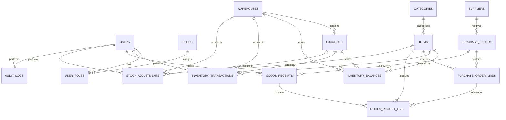

# Requirements and Domain Design

This document defines the requirements, business rules, domain model, and database design for the Mini ERP Inventory Management System.

## Main User Roles

### Admin

- manages users and role assignments
- manages system-wide settings
- has full access to inventory, purchasing, reporting, and audit history

### InventoryManager

- manages items, suppliers, purchase orders, and stock adjustments
- reviews low-stock conditions
- monitors stock movement and inventory reports

### WarehouseStaff

- receives stock against purchase orders
- issues stock for operational use
- views inventory balances and transaction history
- cannot manage users or access sensitive audit functions

### Viewer

- has read-only access to dashboards, reports, item data, and inventory balances
- cannot create, update, receive, issue, or adjust stock

## Core Modules

### Authentication

- login
- token generation
- current user identity
- role-based access control

### Items

- item master creation and maintenance
- category assignment
- reorder threshold management

### Suppliers

- supplier record maintenance
- supplier contact and procurement data

### Purchase Orders

- create purchase orders
- manage purchase order lines
- track order lifecycle

### Goods Receipt

- receive stock against approved purchase orders
- update inventory balances
- update received quantities

### Inventory

- current stock balances
- stock issue flow
- transaction history
- low-stock detection

### Stock Adjustments

- manual increase or decrease of stock
- reason tracking
- approval or restricted access by role

### Reports

- low-stock report
- stock summary
- stock valuation
- recent transaction activity
- purchase order summary

### Audit Logs

- track critical user and system actions
- support traceability and accountability

## Main Use Cases

### 1. User Logs In

- user submits credentials
- system validates identity
- system returns token and role information

### 2. Admin Manages Users

- admin creates a user
- admin assigns one or more roles
- system persists audit entry

### 3. Inventory Manager Creates an Item

- manager enters SKU, name, category, unit, reorder level, and cost
- system validates SKU uniqueness
- item is stored and becomes available for purchasing and inventory tracking

### 4. Inventory Manager Creates a Supplier

- manager enters supplier business details
- supplier becomes available for procurement workflows

### 5. Inventory Manager Creates a Purchase Order

- manager selects a supplier
- manager adds one or more items and quantities
- purchase order is saved in draft or approved state

### 6. Warehouse Staff Receives Stock

- staff selects an approved purchase order
- staff records received quantities
- system increases stock balances
- system creates inventory transactions
- purchase order receipt status is updated

### 7. Warehouse Staff Issues Stock

- staff selects item and quantity
- system verifies available stock
- system reduces inventory
- system logs the issue transaction

### 8. Inventory Manager Performs Stock Adjustment

- manager enters item, quantity delta, and reason
- system updates stock balance
- system records adjustment transaction and audit log

### 9. User Reviews Reports

- user views low-stock items, stock summary, and recent activity
- viewer role remains read-only

## Key Business Rules

- every inventory item must have a unique SKU
- every stock movement must create an inventory transaction record
- stock cannot be silently changed outside approved inventory workflows
- purchase orders must contain at least one line item
- a goods receipt can only be posted against a valid purchase order
- received quantity cannot exceed allowed outstanding quantity
- stock issue actions cannot reduce available quantity below zero unless negative inventory is explicitly allowed in the future
- stock adjustments require a reason
- only authorized roles may create or approve sensitive changes
- low-stock status is triggered when available quantity is less than or equal to reorder level
- audit logs must be created for security-sensitive and stock-changing actions

## System Entities and Relationships

### Identity and Access

- `User`
- `Role`
- `UserRole`

Relationships:

- one user can have many roles
- one role can belong to many users

### Inventory Master Data

- `Category`
- `Item`
- `Supplier`
- `Warehouse`
- `Location`

Relationships:

- one category has many items
- one warehouse has many locations
- one location belongs to one warehouse

### Inventory Operations

- `InventoryBalance`
- `InventoryTransaction`
- `StockAdjustment`

Relationships:

- one item can have many inventory balances across locations
- one item can have many inventory transactions
- one stock adjustment creates one or more inventory transaction records

### Purchasing

- `PurchaseOrder`
- `PurchaseOrderLine`
- `GoodsReceipt`
- `GoodsReceiptLine`

Relationships:

- one supplier has many purchase orders
- one purchase order has many lines
- one goods receipt belongs to one purchase order
- one goods receipt has many lines
- one purchase order line references one item
- one goods receipt line references one purchase order line and one item

### Monitoring and Traceability

- `AuditLog`

Relationships:

- audit logs may reference a user and a business entity

## Auditable Actions

The following actions must create audit log entries:

- successful login
- failed login attempt
- user creation
- role assignment changes
- item creation
- item update
- item status change
- supplier creation
- supplier update
- purchase order creation
- purchase order update
- purchase order status change
- goods receipt posting
- stock issue
- stock receipt
- stock adjustment
- item deactivation
- deletion or soft deletion of sensitive records

In addition to audit logs, all stock movement actions must also create `InventoryTransaction` records.

## Required Fields by Entity

### User

- `id`
- `email`
- `password_hash`
- `full_name`
- `is_active`
- `created_at`

### Role

- `id`
- `name`

### UserRole

- `user_id`
- `role_id`

### Category

- `id`
- `name`

### Supplier

- `id`
- `name`
- `contact_name`
- `email`
- `phone`
- `is_active`
- `created_at`

### Warehouse

- `id`
- `name`
- `code`

### Location

- `id`
- `warehouse_id`
- `name`
- `code`

### Item

- `id`
- `sku`
- `name`
- `category_id`
- `unit`
- `reorder_level`
- `standard_cost`
- `is_active`
- `created_at`

### InventoryBalance

- `id`
- `item_id`
- `warehouse_id`
- `location_id`
- `quantity_on_hand`
- `quantity_reserved`
- `quantity_available`

### InventoryTransaction

- `id`
- `item_id`
- `warehouse_id`
- `location_id`
- `transaction_type`
- `reference_type`
- `reference_id`
- `quantity_change`
- `balance_after`
- `performed_by_user_id`
- `performed_at`

### PurchaseOrder

- `id`
- `po_number`
- `supplier_id`
- `status`
- `order_date`
- `created_by_user_id`
- `created_at`

### PurchaseOrderLine

- `id`
- `purchase_order_id`
- `item_id`
- `ordered_quantity`
- `received_quantity`
- `unit_cost`

### GoodsReceipt

- `id`
- `purchase_order_id`
- `receipt_number`
- `received_at`
- `received_by_user_id`

### GoodsReceiptLine

- `id`
- `goods_receipt_id`
- `purchase_order_line_id`
- `item_id`
- `received_quantity`

### StockAdjustment

- `id`
- `item_id`
- `warehouse_id`
- `location_id`
- `adjustment_type`
- `quantity_delta`
- `reason`
- `performed_by_user_id`
- `performed_at`

### AuditLog

- `id`
- `action`
- `entity_name`
- `entity_id`
- `performed_by_user_id`
- `performed_at`
- `details`

## Status Enums

### PurchaseOrderStatus

- `Draft`
- `Approved`
- `PartiallyReceived`
- `Completed`
- `Cancelled`

### InventoryTransactionType

- `Receipt`
- `Issue`
- `AdjustmentIncrease`
- `AdjustmentDecrease`
- `TransferIn`
- `TransferOut`

### UserRole

- `Admin`
- `InventoryManager`
- `WarehouseStaff`
- `Viewer`

### AdjustmentType

- `Increase`
- `Decrease`

## Entity Relationship Diagram

